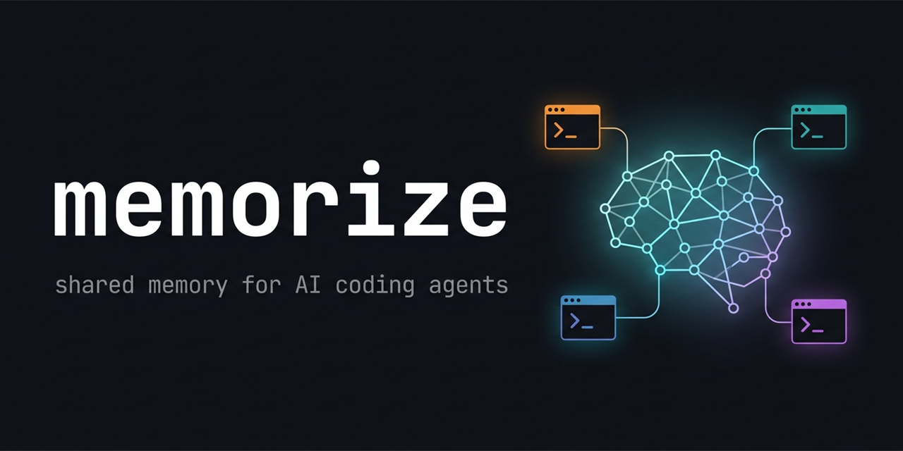

# Memorize — AI 编程智能体的共享记忆

[](https://www.npmjs.com/package/@shakystar/memorize)
[](https://github.com/shakystar/memorize/actions/workflows/ci.yml)
[](../../LICENSE)

[English](../../README.md) | [한국어](./README.ko.md) | [日本語](./README.ja.md) | **简体中文** | [Español](./README.es.md)

<p align="center">
  
</p>


> 你、Claude Code 和 Codex 共享同一个持久的项目大脑 — 本地优先、
> 事件溯源，设计上借鉴了生物记忆的真实运作方式。

会话一结束,智能体就忘掉一切。Memorize 在智能体工作时进行观察,把重要的
内容蒸馏为长期记忆,并在每个未来会话开始时把最相关的记忆重新注入 —
面向项目中的**每一个**智能体、跨机器同步、无需服务器、无需 API key。

## 为什么需要它

- **Claude 会话结束,上下文随之消失。** 下个会话你得重新解释在做什么、
  做过哪些决定、停在了哪里。
- **从 Claude 切到 Codex 等于从零开始。** 每个智能体都有自己的记忆孤岛,
  彼此看不到对方的笔记。
- **两台机器,两个半脑。** 台式机上的上下文不会跟着你的笔记本走。

## 工作原理

1. **捕获** — 智能体工作时,钩子记录廉价的规则过滤观察(文件修改、
   决策、任务流转)。无 LLM,零延迟。
2. **巩固(consolidation)** — 在会话边界,后台进程把观察蒸馏成长期记忆
   (决策、理由、进展)并打上重要度分数。提取通过你已登录的
   `claude` / `codex` CLI 运行 — 无需 API key;也支持任何 OpenAI 兼容
   端点,以及规则兜底。
3. **检索** — 下个会话开始时,记忆按重要度 × 新近度(14 天半衰期,
   被复用时强化)× 与当前任务的相关度竞争上下文预算。遗忘只发生在
   检索时;任何东西都不会被删除。
4. **共享** — 并行会话实时看到彼此的工作(包括文件冲突警告);同一份
   事件日志跨机器同步并确定性收敛。记忆之间的矛盾会被自动检测和解决 —
   新者胜出,旧者保持可还原。

更深入的内容 — 双层 CLS 记忆设计、水位线幂等巩固、检索时遗忘、用
dogfooding 数据演化 schema 的 lifecycle-evidence 计划 — 见
**[ARCHITECTURE.md](../ARCHITECTURE.md)**(英文)。

### 会话开始时智能体看到什么

```text
# Memorize context

Ground rule: memorize is the single source of truth for project state …

Project: Realtime whiteboard MVP
Task: Fix cursor jitter on remote drag
Latest handoff: from codex — "Repro narrowed to the throttle in
  useRemoteCursor; failing test added in cursor-sync.test.ts"
Consolidated memories:
- [decision/s9] WebSocket transport chosen over WebRTC for v1 — simpler
  infra, revisit only if >200ms RTT becomes common
- [rationale/s7] Cursor positions are sent unthrottled on purpose; the
  jitter came from double-throttling, not bandwidth
- [progress/s5] LAN sync verified; jitter reproduces only above 80ms RTT
Recent work signals (prior session tail):
- [write-tool/Edit] src/hooks/useRemoteCursor.ts
- [decision-keyword/Bash] git commit -m "remove inner throttle"
```

无需重新解释。下一个智能体 — 任何智能体、任何机器 — 从这里精确接手。

## 安装

两种方式。**大多数人用第一种就够了** — memorize 的设计就是让你的
AI 助手按项目完成安装。

### 推荐 — 让 AI 替你配置

给 Claude Code 或 Codex 会话发一行提示:

> Set up memorize in this project. Follow the instructions at
> https://github.com/shakystar/memorize/blob/main/guides/AI_SETUP.md

助手会添加包、绑定目录、安装对应的智能体钩子、提议把已有上下文
(它自己的会话记忆、你的决策文档)吸收进 memorize,并验证安装。
之后照常使用 `claude` / `codex` — 上下文在会话开始时自动注入。

随时可以验证:

```sh
npx @shakystar/memorize doctor
```

(npx 请始终使用带 scope 的包名 — npm 上不带 scope 的 `memorize`
是一个无关的包。)

### 手动 — 自己放到 PATH 里

<details>
<summary>一行安装(全局二进制 + <code>memorize setup</code>)</summary>

```sh
# macOS / Linux / WSL
curl -fsSL https://raw.githubusercontent.com/shakystar/memorize/main/scripts/install.sh | sh
```

```powershell
# Windows (PowerShell)
irm https://raw.githubusercontent.com/shakystar/memorize/main/scripts/install.ps1 | iex
```

脚本安装全局二进制后运行 `memorize setup`,自动检测 Claude Code 与
Codex。Codex 集成当场全局接线;Claude 钩子是按项目的,`setup` 会提示你
在每个想用 memorize 的项目里运行 `memorize install claude`。

需要 Node.js >= 22。安装器会检查,缺失时告诉你去哪里获取。

</details>

## 工作目录

- memorize 命令可以在项目内任意位置运行 — 它从当前目录向上查找最近的
  已绑定项目(与 git 行为一致)。
- 项目下的 `.memorize/` 保存按项目的运行时状态。**请把 `.memorize/`
  加入 `.gitignore`**;缺失时 `doctor` 会警告。
- 持久事件日志默认存于 `~/.memorize/`(可用 `MEMORIZE_ROOT` 覆盖)。

## 日常命令

大多数交互由 AI 驱动。人类可能用到的:

```sh
memorize doctor            # 诊断项目 + 集成状态
memorize project show      # 输出绑定项目摘要 (JSON)
memorize task list         # 列出任务 (--status 过滤)
memorize task resume       # 加载当前任务的启动上下文
memorize task handoff ...  # 记录交接给下一个智能体
memorize consolidate       # 立即运行一次记忆巩固边界
```

单独运行 `memorize` 查看用法概览。其余所有命令(setup、install、
memory import、hook、projection rebuild、sync 等)都记录在
[AGENT_GUIDE.md](../../AGENT_GUIDE.md) — AI 需要细节时读这个文件。

## 故障排查

- 安装中途报错 — 把完整错误输出粘贴到 Claude/Codex 会话,并附上
  [AI_SETUP.md](../../guides/AI_SETUP.md) 链接;其中 "Recovering a
  failed install" 一节会引导智能体按序排查常见原因(Node 版本、npm
  全局权限、PATH、WSL 遮蔽)。没有智能体?请用 **Install failure**
  模板提 issue。

- Claude 会话里看不到 memorize 上下文 — 运行 `memorize doctor`,
  按失败检查项的 `fix:` 处理。通常重跑 `memorize install claude`
  即可解决。
- 安装成功但 Codex 什么都不记录 — codex 对外部写入的钩子保持静默跳过,
  直到你在交互式会话中批准一次。`doctor` 会检测并提示这个状态。
- 创建了任务但列表为空 — 运行 `memorize project show` 确认项目 id
  是否一致;你可能位于另一个已绑定项目中。
- 从项目中完全移除:
  - `memorize uninstall claude` / `memorize uninstall codex` —
    移除 memorize 钩子和 ground-rule 块,保留你的其他钩子/配置。
    幂等。已捕获的记忆保持原样。
  - 删除项目下的 `.memorize/` — 清除按项目的运行时状态
  - 可选 `rm -rf ~/.memorize` — 删除所有项目的持久事件日志。
    这是唯一会删除已捕获记忆的步骤。

## 写给 AI 助手

如果用户让你配置 memorize,请遵循
[guides/AI_SETUP.md](../../guides/AI_SETUP.md) — 幂等的配置步骤、既有
上下文的吸收流程,以及 ground rule(memorize 是唯一事实来源;不要把
它的状态复制进你自己的记忆系统)。完整命令行为见
[AGENT_GUIDE.md](../../AGENT_GUIDE.md)。

## 状态

Memorize 处于 `2.x` 线(自 2.0.0 起为 AGPL-3.0-or-later)。
兼容性承诺涵盖:

- 磁盘上的事件日志布局与按项目的 `.memorize/` 目录形态
- 上面列出的日常 CLI 表面
- `install claude` / `install codex` 写入的钩子契约

在同一主版本线内我们不会破坏这些。事件日志带版本管理、投影可再生,
因此主版本内升级无需手动数据迁移。

**实验性**(可能在次版本中变更):

- `memorize project sync` — 文件传输可用且通过往返测试;HTTP 中继
  客户端已内置,但需要单独的中继服务器(开发中)。
- 巩固记忆上的仅观察 lifecycle-evidence 字段与 `consolidate --report`
  的输出形态 — 在分类法决定落地前可能调整的埋点。

发布历史见 [CHANGELOG.md](../../CHANGELOG.md)。

## 社区

Issue 与 Discussion 对所有人开放 — 欢迎 bug 报告、设计辩论和
「怎么做」的提问:

- **[Issues](https://github.com/shakystar/memorize/issues)** — bug 与
  具体的功能请求
- **[Discussions](https://github.com/shakystar/memorize/discussions)** —
  设计方向与开放式想法(记忆分类法的辩论就在这里)

开发流程见 [CONTRIBUTING.md](../../.github/CONTRIBUTING.md)。

## 许可证

AGPL-3.0-or-later。见 [LICENSE](../../LICENSE)。
